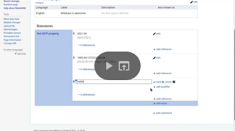

# Wikibase EDTF

[](https://github.com/ProfessionalWiki/WikibaseEdtf/actions?query=workflow%3ACI)
[](https://packagist.org/packages/professional-wiki/wikibase-edtf)
[](https://packagist.org/packages/professional-wiki/wikibase-edtf)
[](LICENSE)

[MediaWiki] extension that adds support for the [Extended Date/Time Format (EDTF) Specification][EDTF] to [Wikibase] via a new data type.

[Professional Wiki] created and maintains Wikibase EDTF. We provide [Wikibase hosting], [Wikibase development], and [Wikibase consulting].

Wikibase EDTF is an open-source project that was made possible with the financial support of the Luxembourg Ministry of Culture. Contributions are welcome!

You can find a demo of this extension at https://edtf.wikibase.wiki

- [Usage](#usage)
	- [RDF export](#rdf-export)
- [Installation](#installation)
- [Running the tests](#running-the-tests)
- [Release notes](#release-notes)

## Usage

<a href="https://www.youtube.com/watch?v=U5ndjtuDPf8"></a>

### RDF export

Wikibase EDTF gives its value to the native RDF export mechanism using the datatypes xsd:EDTF datatype (e.g. "1867-05-26"^^xsd:edtf) and xsd:dateTime. For the latter datatype it turns EDTF values into standard Wikibase time (xsd:dateTime) values. Because Wikibase time values are a lot less expressive, the EDTF values are simplified in this process:

* `EDTF date or time`: Precision and time zone are retained. Qualifications and unspecified digits are discarded.
* `EDTF Set`: Each date in the set is exported.
* `EDTF Season`: One date for each month is exported, each having month precision.
* `EDTF Interval`: Nothing is exported (since there does not seem to be a reasonable default).

For cases where multiple dates are put in the RDF export, like with seasons and sets, there is nothing in the RDF indicating these values logically belong together.

If you can read PHP, you can see the simplification code in [TimeValueBuilder.php](src/Services/TimeValueBuilder.php).

## apparant duplicate results using SPARQL / Blazegraph
Because EDTF exposes the values as both xsd:edtf and a dumbed down xsd:dateTime you will get two values when querying properties with this datatype. using a filter in your SPARQL query can remove the value that you are not interested in:

```
FILTER ( datatype(?date) = xsd:edtf ) #shows only the raw EDTF string from the query results, in this case ?date
```
```
FILTER ( datatype(?date) = xsd:dateTime ) #shows only the dumbed down EDTF strings from the query results, in this case ?date
```
note that if you are using OPTIONAL on the property, then you need to move the FILTER within the OPTIONAL statement.

## Installation

Platform requirements:

* [PHP] 7.4 or later, including PHP 8.x
* [MediaWiki] 1.37 up to 1.39
* [Wikibase Repository] REL1_37, REL1_38, or REL1_39

See the [release notes](#release-notes) for more information on the different versions of this extension.

First install MediaWiki and Wikibase Repository.

The recommended way to install Wikibase EDTF is using [Composer] with
[MediaWiki's built-in support for Composer][Composer install].

On the commandline, go to your wikis root directory. Then run these two commands:

```shell script
COMPOSER=composer.local.json composer require --no-update professional-wiki/wikibase-edtf:^2.0.0
```
If you have MediaWiki 1.36 and earlier, use `^1.2.0` instead of `^2.0.0`

```shell script
composer update professional-wiki/wikibase-edtf --no-dev -o
```

**Enabling the extension**

Then enable the extension by adding the following to the bottom of your wikis "LocalSettings.php" file:

```php
wfLoadExtension( 'WikibaseEdtf' );
```

You can verify the extension was enabled successfully by opening your wiki's "Special:Version" page in your browser.

## Running the tests

* PHP tests: `php tests/phpunit/phpunit.php -c extensions/WikibaseEdtf/`

## Release notes

### Version 2.1.1 - 2023-03-31

* Added support for MediaWiki and Wikibase 1.38 and 1.39
* Translation updates

### Version 2.1.0 - 2023-01-18

* Added support for EDTF 3.x, which brings improved humanizations
* Translation updates

### Version 2.0.1 - 2022-03-26

* Added missing messages for Special:ListDatatypes

### Version 2.0.0 - 2022-01-23

* Added support for MediaWiki and Wikibase 1.37
* Raised minimum MediaWiki and Wikibase versions to 1.37

### Version 1.2.0 - 2021-04-28

* Improved humanization of sets
* Improved validation of intervals and sets
* Fixed DoS vector

### Version 1.1.0 - 2021-04-04

* Added plain EDTF value to RDF output

### Version 1.0.0 - 2021-03-19

* Initial release for MediaWiki/Wikibase 1.35 ([Release announcement], [Demo video])
* EDTF datatype with
  	* Support for EDTF levels 0, 1 and 2
	* Input validation
	* Display of humanized and internationalized version in the reading UI
	* RDF export (using standard Wikibase dates) for most values

[Professional Wiki]: https://professional.wiki
[EDTF]: https://www.loc.gov/standards/datetime/
[Wikibase]: https://wikibase.consulting/what-is-wikibase/
[Wikibase hosting]: https://professional.wiki/en/hosting/wikibase
[Wikibase development]: https://professional.wiki/en/wikibase-software-development
[Wikibase consulting]: https://wikibase.consulting/
[MediaWiki]: https://www.mediawiki.org
[PHP]: https://www.php.net
[Wikibase Repository]: https://www.mediawiki.org/wiki/Extension:Wikibase_Repository
[Composer]: https://getcomposer.org
[Composer install]: https://professional.wiki/en/articles/installing-mediawiki-extensions-with-composer
[Release announcement]: https://wikibase.consulting/wikibase-edtf/
[Demo video]: https://www.youtube.com/watch?v=U5ndjtuDPf8
